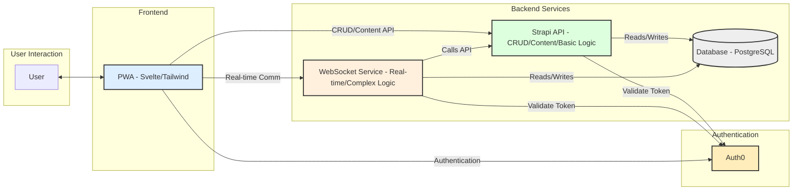

# Sports Organisation Management System

**Architectural Design Document (ADD): Sports Organisation Management System**

**Version:** 0.1
**Date:** April 17, 2025

**1. Introduction**

* **Purpose:** This document outlines the architectural design for a Progressive Web Application (PWA) intended for comprehensive sports management, using organizations like the Uganda Hockey Association as a primary use case.
* **Goals:**
    * Provide a unified platform for managing sport rules, teams, players, staff, competitions, and games.
    * Support real-time game management (scores, events, cards).
    * Implement role-based access control for different user profiles (Admin, Tournament Director, Team Manager, Umpire, etc.).
    * Ensure data integrity through features like approval workflows.
    * Maintain a comprehensive audit trail for all significant actions.
    * Deliver a fast, smooth, interactive user experience characteristic of a PWA, including offline capabilities.
    * Integrate a headless CMS for managing public-facing content.
    * Build a scalable and maintainable system.
* **Scope:** This document covers the high-level architecture, technology stack, data model, security considerations, and how the proposed architecture addresses the core functional requirements.

**2. Architectural Goals & Constraints**

* **Performance:** Prioritize fast load times, smooth interactions, and efficient data handling, even with large datasets (e.g., many games, players, events). Utilize PWA techniques for perceived and actual speed.
* **User Experience:** Deliver an intuitive, responsive interface accessible across devices (desktop, mobile) leveraging PWA installability and offline features.
* **Scalability:** Design to accommodate growth in the number of users, teams, competitions, and historical data.
* **Maintainability:** Emphasize a clear separation of concerns (frontend, backend API, authentication, custom logic). Code should be readable, testable, and communicate intent clearly, aligning with the "story-telling" code principles we discussed.
* **Security:** Implement robust authentication and authorization; protect against common web vulnerabilities.
* **Reliability:** Ensure data consistency, especially for game results and audit trails.
* **Flexibility:** Allow for future feature additions and integrations.

**3. System Architecture (High-Level)**

We will adopt a hybrid architecture leveraging a Headless CMS for core data management and potentially a separate microservice or extended CMS logic for complex operations and real-time features.

* **Diagrammatic Overview:**


* **Components:**
    * **Frontend (PWA):**
        * Framework: Svelte (compiled, performant, reactive)
        * Styling: Tailwind CSS (utility-first, customizable)
        * State Management: Svelte Stores (built-in)
        * PWA Features: Service Workers (offline caching - network-first/cache-first strategies), Web Manifest (installability).
        * Functionality: Renders UI, handles user input, interacts with APIs, manages offline data.
    * **Authentication Service:**
        * Provider: Auth0
        * Functionality: User registration, login, password management, token issuance (JWT), role/permission management integration.
    * **Backend API & CMS (Strapi):**
        * Platform: Strapi (Headless CMS)
        * Functionality:
            * Defines and manages core content types/entities (Teams, Players, Competitions, etc. via the ERD).
            * Provides auto-generated RESTful or GraphQL APIs for CRUD operations.
            * Offers a built-in Admin Panel for data management.
            * Handles basic Role-Based Access Control (RBAC) linked to Auth0 roles.
            * Manages headless content (Homepage, News).
    * **Backend (Complex Logic & Real-time Service):**
        * Option A: Extend Strapi heavily using custom Controllers, Services, and Middleware.
        * Option B: A separate lightweight microservice (e.g., Node.js with Express/NestJS, Python with FastAPI).
        * Functionality (Handles tasks less suited for standard CMS operations):
            * **WebSocket Server:** Manages persistent connections for real-time game updates.
            * **Complex Business Logic:** Game scheduling algorithms, intricate validation rules, multi-step approval workflows.
            * **Intensive Tasks:** Complex report generation, background jobs.
            * **Granular Audit Logging:** Intercepts specific actions (potentially beyond basic CRUD) and logs detailed context to the Audit Trail.
    * **Database:**
        * Type: Relational (e.g., PostgreSQL - recommended for Strapi and structured data).
        * Usage: Stores all application data defined in the Strapi content types (including Audit Trail, CMS Content).
    * **Hosting Environment:**
        * Provider: AWS or GCP.
        * Services: Compute (EC2, App Engine, Cloud Run), Database (RDS, Cloud SQL), Storage (S3, Cloud Storage), CDN (CloudFront, Cloud CDN), Load Balancers, Security Groups.

## Development Setup & Code Organization

This project uses a monorepo-like structure with distinct folders for the frontend and backend, aiming for clear separation of concerns while enabling a streamlined development workflow.

### Code Structure

* **`/` (Root):** Contains shared configuration, the main `docker-compose.yml` for backend services, and helper scripts in `package.json` for orchestrating the development environment.
* **`/FE`:** Contains the SvelteKit frontend application (Progressive Web App). This runs directly on the host machine during development for fast Hot Module Replacement (HMR).
* **`/BE`:** Contains the Strapi backend application, including its `Dockerfile` for containerization.

### Development Philosophy

The motivation behind this setup is:

1.  **Clear Separation:** Keeping frontend and backend codebases distinct enhances maintainability and allows teams (or individuals) to focus on specific parts without interference. This helps keep the "story" of each part clear.
2.  **Backend Consistency:** Using Docker and Docker Compose for the Strapi backend and its database ensures a consistent, reproducible environment across different developer machines and deployment targets.
3.  **Frontend Speed:** Running the SvelteKit frontend locally using its native dev server provides the fastest possible development feedback loop with HMR.
4.  **Simplified Startup:** Despite the separation, the goal is to start the *entire* development environment (containerized backend + local frontend) with a single command, making it easy to get started.

### Running the Project Locally

**Prerequisites:**

* Node.js (LTS version recommended)
* npm (usually included with Node.js)
* Docker
* Docker Compose

**Setup Steps:**

1.  **Clone the repository.**
2.  **Install Root Dependencies:** Navigate to the **root** directory and run `npm install`. This installs tools like `concurrently` needed to run both FE and BE together.
3.  **Install Frontend Dependencies:** Navigate into the `FE` directory (`cd FE`) and run `npm install`.
4.  **Configure Backend Environment:**
    * In the **root** directory, copy the `.env.example` file (you'll need to create this) to a new file named `.env`.
    * Generate the required Strapi security keys/salts (e.g., using `openssl rand -base64 32`) and fill them into the `.env` file for `APP_KEYS`, `API_TOKEN_SALT`, `ADMIN_JWT_SECRET`, and `JWT_SECRET`.
    * Adjust database credentials or other settings in `.env` if needed (defaults are provided for local development).
5.  **Configure Frontend Environment:**
    * In the `FE` directory, copy `.env.example` (if provided) to `.env`.
    * Ensure the `VITE_STRAPI_API_URL` (or equivalent variable for your Svelte setup) points to the backend API, which will be running at `http://localhost:1337/api` by default when using the Docker Compose setup.

**Starting the Development Environment:**

Navigate to the **root** directory of the project in your terminal and run the single command:

```bash
npm run dev
```

**What this command does:**

* It uses the `concurrently` tool defined in the root `package.json`.
* It simultaneously starts:
    * The backend services (`strapi_backend` and `db`) using `docker compose up --build` (as defined in the `start:backend` script). This builds the Strapi image if needed, starts the containers, and maps Strapi to `http://localhost:1337`.
    * The frontend SvelteKit development server using `cd FE && npm run dev` (as defined in the `start:frontend` script). This typically makes the frontend available at `http://localhost:5173` (or another port specified by Vite/SvelteKit).

You should see interleaved output from both the backend (Docker Compose/Strapi) and the frontend (Vite/SvelteKit) in your terminal.

**Accessing Services:**

* **Frontend Application:** `http://localhost:5173` (or your configured Vite port)
* **Backend Strapi API:** `http://localhost:1337`
* **Backend Strapi Admin Panel:** `http://localhost:1337/admin`
* **Database (Optional Direct Access):** `localhost:5433` (mapped from container port 5432)

To stop all services, you can usually press `Ctrl+C` in the terminal where `concurrently` is running. You might sometimes need to run `docker compose down` from the root directory afterwards to ensure the containers are stopped and removed cleanly.

**4. Data Model (ERD)**

The data structure is defined by the following Entity Relationship Diagram (represented using MermaidJS). This forms the basis for the Strapi Content Types.

```mermaid
classDiagram
    class Sport {
        +String sport_id
        +String name
        +String description
    }
    class GameFormat {
        +String game_format_id
        +String sport_id
        +String name
        +Integer total_duration_minutes
        +Integer number_of_periods
        +String period_type
        +Integer period_duration_minutes
    }
    class SportRule {
        +String rule_id
        +String sport_id
        +String rule_name
        +String rule_value
        +String description
    }
    class CompetitionRule {
        +String competition_rule_id
        +String competition_id
        +String sport_rule_id
        +String rule_name
        +String rule_value
        +String value_unit
        +String description
    }
    class Organization {
        +String organization_id
        +String name
        +String type
    }
    class Team {
        +String team_id
        +String organization_id
        +String name
        +String logo_url
        +List~UniformSet~ uniform_colors
    }
    class Person {
        +String person_id
        +String first_name
        +String last_name
        +Date date_of_birth
        +String gender
    }
    class Player {
        <<Person>>
        +String registration_number
    }
    class TeamStaff {
        <<Person>>
        +String staff_role_type
    }
    class PlayerTeamMembership {
        +String membership_id
        +String player_id
        +String team_id
        +String competition_id
        +String shirt_number
        +String role
        +Date registration_date
        +String status_
    }
    class StaffTeamMembership {
        +String membership_id
        +String staff_id
        +String team_id
        +String competition_id
        +String role
    }
    class Competition {
        +String competition_id
        +String organization_id
        +String sport_id
        +String name
        +String type
        +Date start_date
        +Date end_date
        +String status_
    }
    class CompetitionTeam {
        +String participation_id
        +String team_id
        +String competition_id
        +String status_
    }
    class Game {
        +String game_id
        +String competition_id
        +String game_format_id
        +String home_team_id
        +String away_team_id
        +DateTime scheduled_datetime
        +String venue
        +String pitch
        +String status_
        +Integer home_score
        +Integer away_score
        +String lineup_home_status
        +String lineup_away_status
    }
    class PlayersOfTeamForGame {
        +String participation_id
        +String game_id
        +String person_id
        +String team_id
        +String role_in_game
        +String shirt_number
        +String status_
    }
    class GameEvent {
        +String event_id
        +String game_id
        +String event_type
        +DateTime timestamp
        +Integer period_number
        +String time_within_period
        +String player_id
        +String team_id
        +Json details
    }
    class PlayerCompetitionSanction {
        +String sanction_id
        +String player_id
        +String competition_id
        +String triggering_competition_rule_id
        +String sanction_type
        +String reason_text
        +Date suspension_start_date
        +String suspension_start_game_id
        +Integer suspension_duration_games
        +Integer suspension_duration_days
        +String status
        +String notes
    }
    class SanctionTriggeringEvent {
        +String sanction_id
        +String game_event_id
    }
    class Card {
        <<GameEvent>>
    }
    class Goal {
        <<GameEvent>>
    }
    class User {
        +String user_id
        +String person_id
        +String username
        +String password_hash
        +String email
    }
    class Role {
        +String role_id
        +String role_name
    }
    class Permission {
        +String permission_id
        +String action_name
    }
    class Official {
         <<Person>>
        +String certification_level
    }
    class GameOfficial {
        +String assignment_id
        +String official_id
        +String game_id
        +String role
    }
    class AuditTrail {
        +String log_id
        +String user_id
        +String action_performed
        +String entity_affected
        +String entity_id
        +DateTime timestamp
        +Json details_before
        +Json details_after
        +String ip_address
    }
     class CMSContent {
        +String content_id
        +String content_type
        +String title
        +String body
        +Date publish_date
        +String status
    }

    Sport "1" -- "0..*" SportRule
    Sport "1" -- "0..*" GameFormat
    Sport "1" -- "0..*" Competition
    GameFormat "1" -- "0..*" Game
    Competition "1" -- "0..*" CompetitionRule
    SportRule "1" -- "0..*" CompetitionRule
    Competition "1" -- "0..*" PlayerCompetitionSanction
    Player "1" -- "0..*" PlayerCompetitionSanction
    CompetitionRule "1" -- "0..*" PlayerCompetitionSanction
    PlayerCompetitionSanction "1" -- "1..*" SanctionTriggeringEvent
    GameEvent "1" -- "0..*" SanctionTriggeringEvent
    Organization "1" -- "0..*" Team
    Organization "1" -- "0..*" Competition
    Organization "1" -- "0..*" User
    Person <|-- Player
    Person <|-- TeamStaff
    Person <|-- Official
    Person "1" -- "0..*" User
    Team "1" -- "0..*" PlayerTeamMembership
    Player "1" -- "0..*" PlayerTeamMembership
    Team "1" -- "0..*" StaffTeamMembership
    TeamStaff "1" -- "0..*" StaffTeamMembership
    Competition "1" -- "0..*" Game
    Competition "1" -- "0..*" CompetitionTeam
    Team "1" -- "0..*" CompetitionTeam
    Game "1" -- "1" Team
    Game "1" -- "1" Team
    Game "1" -- "0..*" PlayersOfTeamForGame
    Game "1" -- "0..*" GameEvent
    Game "1" -- "0..*" GameOfficial
    Official "1" -- "0..*" GameOfficial
    Person "1" -- "0..*" PlayersOfTeamForGame
    Team "1" -- "0..*" PlayersOfTeamForGame
    Player "1" -- "0..*" GameEvent
    Team "1" -- "0..*" GameEvent
    GameEvent <|-- Card
    GameEvent <|-- Goal
    User "1..*" -- "1..*" Role
    Role "1" -- "0..*" Permission
    User "1" -- "0..*" AuditTrail

```



**5. Technology Stack Summary**

* **Frontend:** Svelte, Tailwind CSS
* **Backend/CMS:** Strapi
* **Complex Logic/Real-time:** Node.js (Express/NestJS/Koa) or Python (FastAPI/Django) OR Strapi Custom Controllers/Services; WebSockets (e.g., Socket.IO, ws library)
* **Authentication:** Auth0
* **Database:** PostgreSQL (or MySQL/MariaDB compatible with Strapi)
* **Hosting:** AWS / GCP

**6. Scenario Handling**

This architecture addresses the initial requirements as follows:

* **Define Global Sport Rules:** Managed as `SportRule` content type in Strapi. Accessed via API by PWA.
* **Setup Teams/Players/Staff:** CRUD operations via PWA forms talking to Strapi API endpoints for `Team`, `Player`, `TeamStaff`, `TeamMembership`, `StaffMembership` entities[cite: 10, 11, 16, 56]. Roles (Org Manager, Team Manager) managed by Auth0/Strapi RBAC control access.
* **Setup Competitions:** CRUD via PWA/Strapi for `Competition`. Linking teams via `CompetitionParticipant`[cite: 10, 67]. Complex scheduling (fixture generation) handled by custom logic service/Strapi extension.
* **Setup Games:** `Game` entities created in Strapi, potentially via the custom logic service for automated generation based on competition format. Manual creation/import via PWA/Strapi API.
* **Manage Game - Team Sheets/Lineups:**
    * Team Manager submits lineup via PWA, creating/updating `GameAppearance` records linked to the `Game`[cite: 36, 40].
    * Lineup status (`Game.lineup_home_status`, `Game.lineup_away_status`) updated.
    * **Approval:** A designated role (e.g., Technical Officer, Judge) views pending lineups in PWA, triggers an approval action via API (Strapi or custom service). This updates the status field and potentially triggers notifications. Custom logic handles the workflow.
* **Manage Game - Real-time Events:**
    * Authorized users (Umpire, Judge) interact with PWA during the game.
    * Actions (start/end period, goal, card) send messages via WebSocket to the real-time service.
    * Service validates action, updates relevant Strapi entities (`Game` score, create `GameEvent`), logs audit trail, and broadcasts updates via WebSocket to all subscribed clients (live score view).
* **User Profiles & Login:** Auth0 handles login/identity. PWA receives JWT. Strapi/Custom Service validate JWT and use associated roles/permissions for authorization.
* **Approvals:** Implemented using status fields on relevant entities (e.g., `TeamMembership`, `Game`) and controlled access via RBAC. Custom logic service or Strapi controllers/services manage the state transitions based on user actions.
* **Audit Trails:** Middleware in Strapi or the custom service intercepts relevant API calls (POST, PUT, DELETE). It logs details (who, what, when, before/after state) to the `AuditTrail` entity in Strapi.
* **Headless CMS Content:** Managed via `CMSContent` type in Strapi Admin UI. PWA fetches published content via Strapi API for display (e.g., homepage).
* **Performance & Interactivity:** Addressed via Svelte's compilation, PWA caching/service workers, optimized API calls (GraphQL option in Strapi helps), virtualization in PWA for long lists, CDN for assets, and efficient WebSocket handling.

**7. Security Considerations**

* **Authentication:** Handled by Auth0 (OAuth 2.0 / OIDC). JWTs used for API authentication.
* **Authorization:** RBAC implemented in Strapi, potentially augmented by checks in the custom logic service based on Auth0 roles/permissions.
* **Transport Security:** HTTPS enforced for all communication.
* **Input Validation:** Performed both on the PWA frontend and backend APIs (Strapi validations, custom logic checks).
* **OWASP Top 10:** Standard practices applied (e.g., preventing injection, XSS, CSRF).
* **Secrets Management:** Secure handling of API keys, database credentials (using environment variables, secrets managers).

**8. Deployment Strategy**

* **Infrastructure:** Provisioned using Infrastructure as Code (e.g., Terraform, CloudFormation) is recommended.
* **CI/CD:** Automated pipelines (e.g., GitHub Actions, GitLab CI, Jenkins) for building, testing, and deploying the PWA (to static hosting/CDN), Strapi, and the custom service.
* **Environments:** Separate Development, Staging, and Production environments.

**9. Detailed Use cases**

**1. `Organization`**

* **Use Case:** Aisha, working for the Uganda Hockey Association (UHA), sets up UHA in the system.
    * **Interaction:** Uses an admin form in the PWA.
    * **System Action:** Creates an `Organization` record.
    * **Attributes:** `organization_id` (unique ID), `name` ("Uganda Hockey Association"), `type` ("Governing Body").
    * **Later:** David from Kampala Hockey Club (KHC) registers his club (`name`="Kampala Hockey Club", `type`="Club").

**2. `Sport`**

* **Use Case:** Aisha ensures "Hockey" is defined.
    * **Interaction:** Admin form.
    * **System Action:** Creates a `Sport` record.
    * **Attributes:** `sport_id` (unique ID), `name` ("Hockey"), `description` ("Field hockey rules...").
    * **Purpose:** Central identifier for hockey-related activities.

**3. `GameFormat`**

* **Use Case:** Aisha defines standard game formats like "FIH Outdoor 60min Quarters".
    * **Interaction:** Admin form for formats.
    * **System Action:** Creates `GameFormat` records.
    * **Attributes:** `game_format_id` (unique ID), `sport_id` (links to Hockey), `name` ("FIH Outdoor 60min Quarters"), `total_duration_minutes` (60), `number_of_periods` (4), `period_type` ("Quarter"), `period_duration_minutes` (15).
    * **Purpose:** Standardizes game structures.

**4. `SportRule`**

* **Use Case:** Aisha documents fundamental Hockey rules, like standard player count.
    * **Interaction:** Admin form for sport rules.
    * **System Action:** Creates `SportRule` records.
    * **Attributes:** `rule_id` (unique ID), `sport_id` (links to Hockey), `rule_name` ("Player Count Standard"), `rule_value` ("11"), `description` ("Standard players on pitch").

**5. `Competition`**

* **Use Case:** Sarah (UHA Competition Director) sets up the "Kampala Cup 2025".
    * **Interaction:** Uses "Competitions" section in PWA, creates new.
    * **System Action:** Creates a `Competition` record.
    * **Attributes:** `competition_id` (unique ID), `organization_id` (links to UHA), `sport_id` (links to Hockey), `name` ("Kampala Cup 2025"), `type` ("Tournament"), `start_date`, `end_date`, `status_` (starts as "Draft", progresses to "Published", "InProgress").

**6. `CompetitionRule`**

* **Use Case:** Sarah sets a 2-game suspension for red cards specifically for the Kampala Cup.
    * **Interaction:** Adds a rule within the Kampala Cup settings.
    * **System Action:** Creates a `CompetitionRule` record.
    * **Attributes:** `competition_rule_id` (unique ID), `competition_id` (links to Kampala Cup), `sport_rule_id` (optional link to base rule), `rule_name` ("Red Card Suspension Duration"), `rule_value` ("2"), `value_unit` ("Games").

**7. `Team`**

* **Use Case:** David (KHC admin) registers "KHC Stallions" for the Kampala Cup.
    * **Interaction:** Uses "Register Team" feature for the competition.
    * **System Action:** Creates/updates a `Team` record.
    * **Attributes:** `team_id` (unique ID), `organization_id` (links to KHC), `name` ("KHC Stallions"), `logo_url`, `uniform_colors` (structured description of kits).

**8. `Person`**

* **Use Case:** Mary (Weatherhead Gazelles TM) registers a new player, Peter Okello.
    * **Interaction:** Uses "Register New Person/Player" form.
    * **System Action:** Creates a `Person` record if Peter is new to the system.
    * **Attributes:** `person_id` (unique ID), `first_name`, `last_name`, `date_of_birth`, `gender`.

**9. `Player`**

* **Use Case:** After creating Peter's `Person` record, it's linked to a `Player` profile.
    * **Interaction:** Part of the player registration workflow.
    * **System Action:** Creates a `Player` record linked to `Person`.
    * **Attributes:** `(person_id)` (link), `registration_number` (e.g., "UHA-P-12345").

**10. `TeamStaff`**

* **Use Case:** Mary adds her coach, Joseph, identifying him as staff.
    * **Interaction:** Registers Joseph as `Person` (if new), then designates as staff.
    * **System Action:** Creates `TeamStaff` record linked to Joseph's `Person`.
    * **Attributes:** `(person_id)` (link), `staff_role_type` (e.g., "Coach").

**11. `PlayerTeamMembership`**

* **Use Case:** Mary adds Peter Okello to the Weatherhead roster for the Kampala Cup.
    * **Interaction:** Uses team roster management for the specific competition.
    * **System Action:** Creates `PlayerTeamMembership` record.
    * **Attributes:** `membership_id` (unique ID), `player_id` (Peter), `team_id` (Weatherhead), `competition_id` (Kampala Cup), `shirt_number` ("15"), `role` ("Player"), `registration_date`, `status_` ("Registered", then "Approved").

**12. `StaffTeamMembership`**

* **Use Case:** Mary adds Coach Joseph to the official staff list for the cup.
    * **Interaction:** Roster management for staff.
    * **System Action:** Creates `StaffTeamMembership` record.
    * **Attributes:** Links `staff_id` (Joseph), `team_id`, `competition_id`, specifies `role` ("Head Coach").

**13. `CompetitionTeam`**

* **Use Case:** Records that KHC Stallions are participating in the Kampala Cup.
    * **Interaction:** Automatic upon team registration for the competition.
    * **System Action:** Creates `CompetitionTeam` record.
    * **Attributes:** `participation_id` (unique ID), `team_id` (KHC), `competition_id` (Kampala Cup), `status_` ("Registered").

**14. `Game`**

* **Use Case:** System/Sarah creates the KHC vs Weatherhead match.
    * **Interaction:** Automated or manual game creation.
    * **System Action:** Creates `Game` record.
    * **Attributes:** `game_id`, `competition_id`, `game_format_id`, `home_team_id`, `away_team_id`, `scheduled_datetime`, `venue`, `pitch`, `status_` ("Scheduled"), `home_score` (0), `away_score` (0), `lineup_home_status` ("Pending"), `lineup_away_status` ("Pending").

**15. `PlayersOfTeamForGame`**

* **Use Case:** Mary submits Weatherhead's lineup for the game against KHC.
    * **Interaction:** Selects players for the specific game from her competition roster.
    * **System Action:** Creates multiple `PlayersOfTeamForGame` records; updates `Game.lineup_away_status` to "Submitted".
    * **Attributes (for Peter):** `participation_id` (unique ID for this game participation), `game_id`, `person_id` (Peter), `team_id` (Weatherhead), `role_in_game` ("Starter"), `shirt_number` ("15"), `status_` ("Starting").

**16. `GameEvent`**

* **Use Case:** Umpire James records events live. Peter (#15) gets a Green Card in Q4 at 8:15.
    * **Interaction:** Uses live game input on PWA.
    * **System Action:** Creates `GameEvent` record.
    * **Attributes:** `event_id`, `game_id`, `event_type` ("Card"), `timestamp` (absolute time), `period_number` (4), `time_within_period` ("08:15"), `player_id` (Peter), `team_id` (Weatherhead), `details` (`{ "cardType": "Green", ... }`).

**17. `PlayerCompetitionSanction`** (Previously PlayerSuspension)

* **Use Case:** Peter gets a red card later. Backend logic applies the Kampala Cup rule.
    * **Interaction:** Automatic logic triggered by the red card `GameEvent`.
    * **System Action:** Creates `PlayerCompetitionSanction` record.
    * **Attributes:** `sanction_id` (unique ID), `player_id` (Peter), `competition_id` (Kampala Cup), `triggering_competition_rule_id` (links to the Cup's Red Card rule), `sanction_type` ("Suspension"), `reason_text` ("Red Card in Game #XYZ"), `suspension_start_game_id` (links to Weatherhead's *next* game), `suspension_duration_games` (2), `status` ("Active").

**18. `SanctionTriggeringEvent`**

* **Use Case:** Explicitly links Peter's sanction to the specific red card event.
    * **Interaction:** Automatic logic when the sanction is created.
    * **System Action:** Creates `SanctionTriggeringEvent` record.
    * **Attributes:** `sanction_id` (links to the sanction), `game_event_id` (links to the red card `GameEvent`). If the sanction was due to accumulated yellows, multiple records linking the same `sanction_id` to different yellow card `game_event_id`s would be created here.

**19. `User`, `Role`, `Permission`**

* **Use Case:** Sarah logs in. The system checks her "CompetitionDirector" role (managed in Strapi RBAC) against permissions.
    * **Interaction:** Login via Auth0; subsequent actions validated against permissions.
    * **System Action:** Strapi's RBAC verifies if the "CompetitionDirector" `Role` (identified by `role_id`) has the required `Permission` (e.g., "ApproveLineup", identified by `permission_id`) before allowing Sarah to approve a lineup. `User` links to Sarah's `person_id`.

**20. `Official`, `GameOfficial`**

* **Use Case:** Sarah assigns Umpire James Omondi to the KHC vs WHG game.
    * **Interaction:** Uses game management UI to assign officials.
    * **System Action:** Creates `GameOfficial` record.
    * **Attributes:** `assignment_id`, `official_id` (links to James' `Official`/`Person`), `game_id`, `role` ("Umpire").

**21. `AuditTrail`**

* **Use Case (MVP Context):** This entity was removed from our ERD to rely on Strapi's built-in features for the MVP.
    * **If using Strapi Enterprise:** Actions like Sarah updating a game score would be automatically logged in Strapi's built-in Audit Log section within the Admin Panel, showing user, action, timestamp, and potentially changed data.
    * **If using Strapi Community:** There is no built-in audit log. Basic logging for critical actions (like score changes) would need to be manually implemented using Strapi's lifecycle hooks or custom controllers, perhaps logging to the console or a simple custom "Log" content type if absolutely needed for the MVP. The comprehensive tracking originally envisioned in our custom `AuditTrail` entity wouldn't be present without this custom work or upgrading.

**22. `CMSContent`**

* **Use Case:** David (Comms Officer) publishes a match report for the KHC vs WHG game.
    * **Interaction:** Uses Strapi Admin Panel (or dedicated CMS interface) to create content.
    * **System Action:** Creates `CMSContent` record.
    * **Attributes:** `content_id`, `content_type` ("MatchReport"), `title`, `body`, `publish_date`, `status` ("Published").
    * **Result:** Public website/PWA fetches via Strapi API to display.

---
