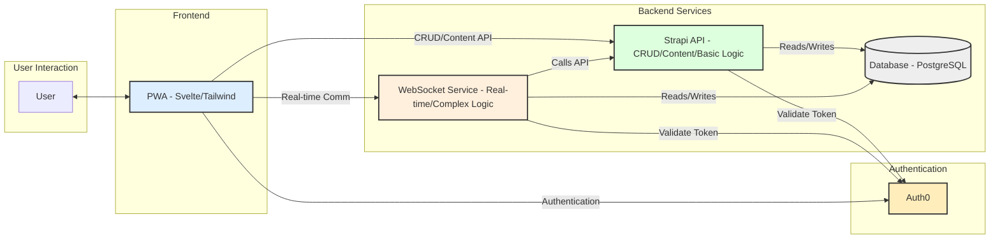
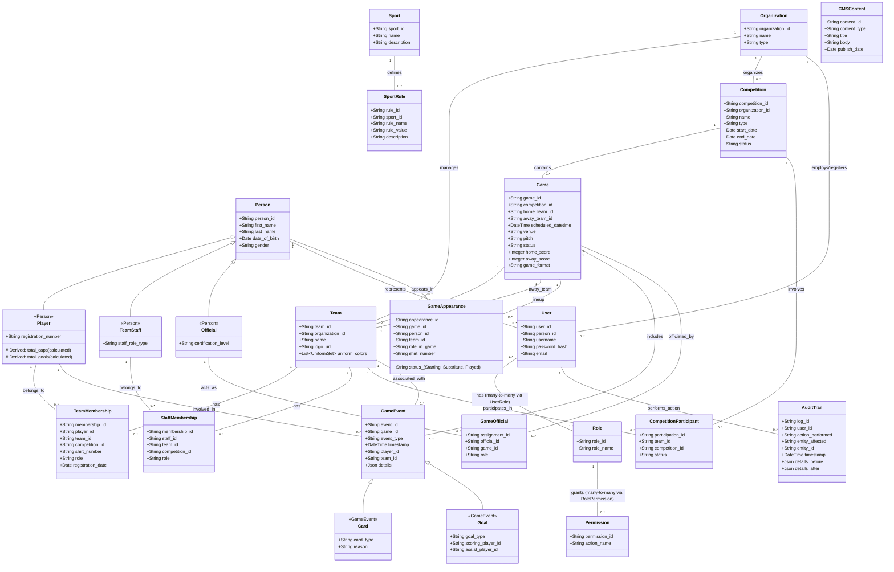

# Sports Organisation Management System

**Architectural Design Document (ADD): Sports Organisation Management System**

**Version:** 0.1
**Date:** April 17, 2025

**1. Introduction**

* **Purpose:** This document outlines the architectural design for a Progressive Web Application (PWA) intended for comprehensive sports management, using organizations like the Uganda Hockey Association as a primary use case.
* **Goals:**
    * Provide a unified platform for managing sport rules, teams, players, staff, competitions, and games.
    * Support real-time game management (scores, events, cards).
    * Implement role-based access control for different user profiles (Admin, Tournament Director, Team Manager, Umpire, etc.).
    * Ensure data integrity through features like approval workflows.
    * Maintain a comprehensive audit trail for all significant actions.
    * Deliver a fast, smooth, interactive user experience characteristic of a PWA, including offline capabilities.
    * Integrate a headless CMS for managing public-facing content.
    * Build a scalable and maintainable system.
* **Scope:** This document covers the high-level architecture, technology stack, data model, security considerations, and how the proposed architecture addresses the core functional requirements.

**2. Architectural Goals & Constraints**

* **Performance:** Prioritize fast load times, smooth interactions, and efficient data handling, even with large datasets (e.g., many games, players, events). Utilize PWA techniques for perceived and actual speed.
* **User Experience:** Deliver an intuitive, responsive interface accessible across devices (desktop, mobile) leveraging PWA installability and offline features.
* **Scalability:** Design to accommodate growth in the number of users, teams, competitions, and historical data.
* **Maintainability:** Emphasize a clear separation of concerns (frontend, backend API, authentication, custom logic). Code should be readable, testable, and communicate intent clearly, aligning with the "story-telling" code principles we discussed.
* **Security:** Implement robust authentication and authorization; protect against common web vulnerabilities.
* **Reliability:** Ensure data consistency, especially for game results and audit trails.
* **Flexibility:** Allow for future feature additions and integrations.

**3. System Architecture (High-Level)**

We will adopt a hybrid architecture leveraging a Headless CMS for core data management and potentially a separate microservice or extended CMS logic for complex operations and real-time features.

* **Diagrammatic Overview:**

* **Components:**
    * **Frontend (PWA):**
        * Framework: Svelte (compiled, performant, reactive)
        * Styling: Tailwind CSS (utility-first, customizable)
        * State Management: Svelte Stores (built-in)
        * PWA Features: Service Workers (offline caching - network-first/cache-first strategies), Web Manifest (installability).
        * Functionality: Renders UI, handles user input, interacts with APIs, manages offline data.
    * **Authentication Service:**
        * Provider: Auth0
        * Functionality: User registration, login, password management, token issuance (JWT), role/permission management integration.
    * **Backend API & CMS (Strapi):**
        * Platform: Strapi (Headless CMS)
        * Functionality:
            * Defines and manages core content types/entities (Teams, Players, Competitions, etc. via the ERD).
            * Provides auto-generated RESTful or GraphQL APIs for CRUD operations.
            * Offers a built-in Admin Panel for data management.
            * Handles basic Role-Based Access Control (RBAC) linked to Auth0 roles.
            * Manages headless content (Homepage, News).
    * **Backend (Complex Logic & Real-time Service):**
        * Option A: Extend Strapi heavily using custom Controllers, Services, and Middleware.
        * Option B: A separate lightweight microservice (e.g., Node.js with Express/NestJS, Python with FastAPI).
        * Functionality (Handles tasks less suited for standard CMS operations):
            * **WebSocket Server:** Manages persistent connections for real-time game updates.
            * **Complex Business Logic:** Game scheduling algorithms, intricate validation rules, multi-step approval workflows.
            * **Intensive Tasks:** Complex report generation, background jobs.
            * **Granular Audit Logging:** Intercepts specific actions (potentially beyond basic CRUD) and logs detailed context to the Audit Trail.
    * **Database:**
        * Type: Relational (e.g., PostgreSQL - recommended for Strapi and structured data).
        * Usage: Stores all application data defined in the Strapi content types (including Audit Trail, CMS Content).
    * **Hosting Environment:**
        * Provider: AWS or GCP.
        * Services: Compute (EC2, App Engine, Cloud Run), Database (RDS, Cloud SQL), Storage (S3, Cloud Storage), CDN (CloudFront, Cloud CDN), Load Balancers, Security Groups.

**4. Data Model (ERD)**

The data structure is defined by the following Entity Relationship Diagram (represented using MermaidJS). This forms the basis for the Strapi Content Types.

**5. Technology Stack Summary**

* **Frontend:** Svelte, Tailwind CSS
* **Backend/CMS:** Strapi
* **Complex Logic/Real-time:** Node.js (Express/NestJS/Koa) or Python (FastAPI/Django) OR Strapi Custom Controllers/Services; WebSockets (e.g., Socket.IO, ws library)
* **Authentication:** Auth0
* **Database:** PostgreSQL (or MySQL/MariaDB compatible with Strapi)
* **Hosting:** AWS / GCP

**6. Scenario Handling**

This architecture addresses the initial requirements as follows:

* **Define Global Sport Rules:** Managed as `SportRule` content type in Strapi. Accessed via API by PWA.
* **Setup Teams/Players/Staff:** CRUD operations via PWA forms talking to Strapi API endpoints for `Team`, `Player`, `TeamStaff`, `TeamMembership`, `StaffMembership` entities[cite: 10, 11, 16, 56]. Roles (Org Manager, Team Manager) managed by Auth0/Strapi RBAC control access.
* **Setup Competitions:** CRUD via PWA/Strapi for `Competition`. Linking teams via `CompetitionParticipant`[cite: 10, 67]. Complex scheduling (fixture generation) handled by custom logic service/Strapi extension.
* **Setup Games:** `Game` entities created in Strapi, potentially via the custom logic service for automated generation based on competition format. Manual creation/import via PWA/Strapi API.
* **Manage Game - Team Sheets/Lineups:**
    * Team Manager submits lineup via PWA, creating/updating `GameAppearance` records linked to the `Game`[cite: 36, 40].
    * Lineup status (`Game.lineup_home_status`, `Game.lineup_away_status`) updated.
    * **Approval:** A designated role (e.g., Technical Officer, Judge) views pending lineups in PWA, triggers an approval action via API (Strapi or custom service). This updates the status field and potentially triggers notifications. Custom logic handles the workflow.
* **Manage Game - Real-time Events:**
    * Authorized users (Umpire, Judge) interact with PWA during the game.
    * Actions (start/end period, goal, card) send messages via WebSocket to the real-time service.
    * Service validates action, updates relevant Strapi entities (`Game` score, create `GameEvent`), logs audit trail, and broadcasts updates via WebSocket to all subscribed clients (live score view).
* **User Profiles & Login:** Auth0 handles login/identity. PWA receives JWT. Strapi/Custom Service validate JWT and use associated roles/permissions for authorization.
* **Approvals:** Implemented using status fields on relevant entities (e.g., `TeamMembership`, `Game`) and controlled access via RBAC. Custom logic service or Strapi controllers/services manage the state transitions based on user actions.
* **Audit Trails:** Middleware in Strapi or the custom service intercepts relevant API calls (POST, PUT, DELETE). It logs details (who, what, when, before/after state) to the `AuditTrail` entity in Strapi.
* **Headless CMS Content:** Managed via `CMSContent` type in Strapi Admin UI. PWA fetches published content via Strapi API for display (e.g., homepage).
* **Performance & Interactivity:** Addressed via Svelte's compilation, PWA caching/service workers, optimized API calls (GraphQL option in Strapi helps), virtualization in PWA for long lists, CDN for assets, and efficient WebSocket handling.

**7. Security Considerations**

* **Authentication:** Handled by Auth0 (OAuth 2.0 / OIDC). JWTs used for API authentication.
* **Authorization:** RBAC implemented in Strapi, potentially augmented by checks in the custom logic service based on Auth0 roles/permissions.
* **Transport Security:** HTTPS enforced for all communication.
* **Input Validation:** Performed both on the PWA frontend and backend APIs (Strapi validations, custom logic checks).
* **OWASP Top 10:** Standard practices applied (e.g., preventing injection, XSS, CSRF).
* **Secrets Management:** Secure handling of API keys, database credentials (using environment variables, secrets managers).

**8. Deployment Strategy**

* **Infrastructure:** Provisioned using Infrastructure as Code (e.g., Terraform, CloudFormation) is recommended.
* **CI/CD:** Automated pipelines (e.g., GitHub Actions, GitLab CI, Jenkins) for building, testing, and deploying the PWA (to static hosting/CDN), Strapi, and the custom service.
* **Environments:** Separate Development, Staging, and Production environments.

**9. Future Considerations**

* **Advanced Reporting:** Integration with a dedicated reporting/analytics tool if needed.
* **Mobile Apps:** APIs designed to potentially support native mobile apps in the future.
* **External Integrations:** API design to facilitate potential future integrations (e.g., payment gateways, other sports bodies).
* **Database Scaling:** Strategies like read replicas, sharding if data volume grows extremely large.

---
