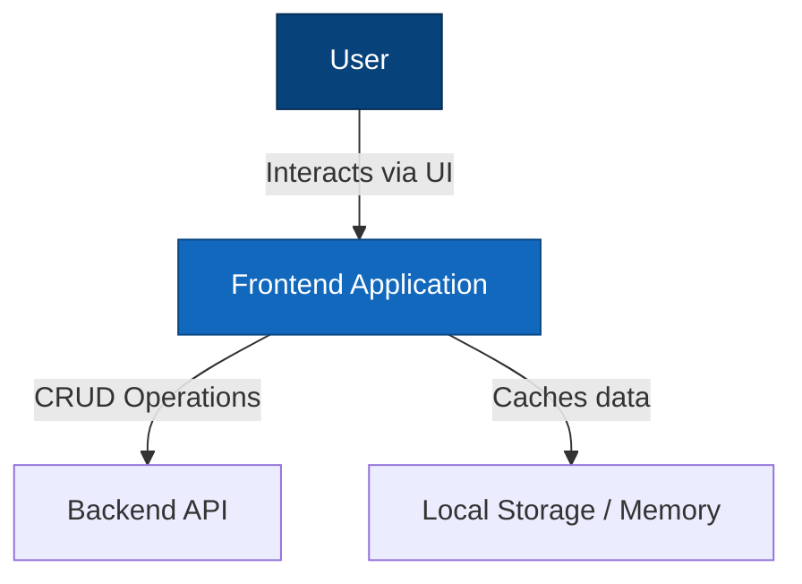

# Sports Organisation Management System - Frontend

A SvelteKit-based frontend for managing sports organizations, competitions, teams, players, and games. Built with TypeScript and Tailwind CSS, following Hexagonal Architecture (Ports and Adapters pattern) for clean separation of concerns and testability.

## The Problem

Managing sports organizations involves complex workflows: registering teams, managing player rosters, scheduling fixtures, recording live game events, and tracking standings. Traditional implementations often result in:

- Duplicated CRUD code for each entity
- Tightly coupled components that are hard to test
- Inconsistent UI patterns across different modules
- Difficulty adapting to different data sources (memory, API, database)

## The Solution

This frontend provides:

- **Generalized CRUD System**: Single implementation handles all entities via metadata
- **Hexagonal Architecture**: Core logic isolated from external dependencies
- **Mobile-First Design**: Responsive layouts optimized for all screen sizes
- **Type-Safe Development**: Full TypeScript support with validation
- **Dependency Injection**: All dependencies injected for easy testing and swapping

## Architecture

This application follows **Hexagonal Architecture** (Ports and Adapters pattern) to maintain clean separation between business logic and external dependencies.

### C4 Model - System Context



### Key Architectural Patterns

**Hexagonal Architecture Benefits**:

- **Testability**: Core logic isolated from external dependencies, enabling comprehensive unit testing with mocks
- **Flexibility**: Easy to swap implementations (e.g., replace InMemory repository with Supabase)
- **Maintainability**: Clear boundaries between business logic and infrastructure concerns

**Layer Responsibilities**:

| Layer              | Direction  | Purpose                                              |
| ------------------ | ---------- | ---------------------------------------------------- |
| **Ports**          | Data IN →  | Interfaces for external systems sending data to core |
| **Adapters**       | Data OUT → | Implementations for core sending data to external    |
| **Core**           | —          | Pure business logic with no external dependencies    |
| **Presentation**   | —          | UI components and Svelte stores                      |
| **Infrastructure** | —          | Cross-cutting utilities (DI container, registries)   |

**Port Interfaces** (defined in `core/interfaces/ports/`):

- `PlayerUseCasesPort`: Player management operations
- `TeamUseCasesPort`: Team management operations
- `FixtureUseCasesPort`: Fixture/game scheduling operations
- All entities have corresponding UseCase port interfaces

**Adapter Interfaces** (defined in `core/interfaces/adapters/`):

- `PlayerRepository`: Abstract player data storage
- `TeamRepository`: Abstract team data storage
- `FixtureRepository`: Abstract fixture data storage
- All entities have corresponding Repository interfaces

**Dependency Injection**: All external dependencies injected via `UseCasesContainer` and `RepositoryContainer` for runtime flexibility and testability.

## Project Structure

```
src/lib/
├── core/                              # CORE DOMAIN LAYER
│   │                                  # Pure business logic, no external dependencies
│   │
│   ├── entities/                      # Domain entities and value objects
│   │   ├── BaseEntity.ts              # Base entity with id, timestamps
│   │   ├── Player.ts                  # Player entity with validation
│   │   ├── Team.ts                    # Team entity
│   │   ├── Competition.ts             # Competition entity
│   │   ├── Fixture.ts                 # Game/fixture entity with events
│   │   └── ...                        # 20+ domain entities
│   │
│   ├── interfaces/                    # Abstract contracts (TypeScript interfaces)
│   │   ├── ports/                     # Interfaces for INCOMING data (use cases)
│   │   │   ├── BaseUseCasesPort.ts    # Base use case interface
│   │   │   ├── PlayerUseCasesPort.ts  # Player operations contract
│   │   │   └── ...                    # All entity use case ports
│   │   └── adapters/                  # Interfaces for OUTGOING data (repositories)
│   │       ├── Repository.ts          # Base repository interface
│   │       ├── PlayerRepository.ts    # Player data access contract
│   │       └── ...                    # All entity repository interfaces
│   │
│   ├── usecases/                      # Application use cases (implementations)
│   │   ├── BaseUseCases.ts            # Base use case types
│   │   ├── PlayerUseCases.ts          # Player business logic
│   │   ├── FixtureUseCases.ts         # Fixture operations with game events
│   │   └── ...                        # All entity use cases
│   │
│   ├── services/                      # Domain services
│   │   ├── fixtureLineupWizard.ts     # Lineup submission workflow
│   │   ├── teamPlayers.ts             # Team roster operations
│   │   └── WorkflowStateMachine.ts    # State machine for workflows
│   │
│   └── types/                         # Shared types and value objects
│       ├── Result.ts                  # Result<T, E> type for error handling
│       └── SubEntityFilter.ts         # Filter types
│
├── ports/                             # PORTS LAYER (Data IN)
│   │                                  # Implementations that DRIVE the application
│   │                                  # (Currently empty - reserved for webhooks, etc.)
│
├── adapters/                          # ADAPTERS LAYER (Data OUT)
│   │                                  # Implementations the application DRIVES
│   │
│   ├── repositories/                  # Repository implementations
│   │   ├── InMemoryBaseRepository.ts  # Generic in-memory storage
│   │   ├── InMemoryPlayerRepository.ts
│   │   └── ...                        # All entity repositories
│   │
│   └── services/                      # External service adapters
│       ├── UnifiedApiService.ts       # API client for backend
│       ├── seedingService.ts          # Test data generation
│       └── ...                        # Other service adapters
│
├── presentation/                      # PRESENTATION LAYER
│   │                                  # User interface components
│   │
│   ├── components/                    # Svelte components
│   │   ├── DynamicEntityForm.svelte   # Auto-generated CRUD forms
│   │   ├── DynamicEntityList.svelte   # Auto-generated entity lists
│   │   ├── EntityCrudWrapper.svelte   # Combined CRUD interface
│   │   ├── UiWizardStepper.svelte     # Multi-step workflow wizard
│   │   ├── LiveGameManagement.svelte  # Real-time game interface
│   │   ├── ui/                        # Reusable UI primitives
│   │   ├── layout/                    # Layout components
│   │   └── theme/                     # Theme components
│   │
│   └── stores/                        # Svelte stores
│       ├── branding.ts                # Organization branding state
│       ├── theme.ts                   # Theme configuration
│       └── memoryStore.ts             # In-memory data store
│
└── infrastructure/                    # INFRASTRUCTURE LAYER
    │                                  # Cross-cutting utilities
    │
    ├── container.ts                   # Dependency injection container
    ├── registry/                      # Metadata registries
    │   ├── EntityMetadataRegistry.ts  # Entity field definitions
    │   └── entityUseCasesRegistry.ts  # Use case factory registry
    └── utils/                         # Utilities
        ├── countries.ts               # Country data
        ├── FakeDataGenerator.ts       # Test data factory
        └── SeedDataGenerator.ts       # Seed data generation
```

### Architecture Quick Reference

| Layer              | Purpose                | Dependencies    | Example                             |
| ------------------ | ---------------------- | --------------- | ----------------------------------- |
| **Core**           | Business logic & rules | None (pure TS)  | Validating players, fixture scoring |
| **Ports**          | External events IN     | Core interfaces | Webhooks, external integrations     |
| **Adapters**       | External services OUT  | Core interfaces | InMemory storage, API clients       |
| **Presentation**   | User interface         | Core models     | CRUD forms, game management UI      |
| **Infrastructure** | Utilities              | None            | DI container, metadata registries   |

### Data Flow

```
[User Input] → Presentation → UseCases (Core) → Adapters → [Storage/API]
                    ↓                ↓
              Svelte Stores    Domain Services
                    ↓
              [UI Updates]
```

## Generalized CRUD System

Instead of separate CRUD implementations for each entity, this system automatically adapts based on entity metadata.

### Core Components

1. **EntityMetadataRegistry** - Centralized metadata definitions for all entities
2. **DynamicEntityForm** - Auto-generates forms based on entity metadata
3. **DynamicEntityList** - Auto-generates lists with CRUD operations
4. **EntityCrudWrapper** - Combines form and list for complete entity management

### Adding a New Entity

```typescript
// 1. Define entity in core/entities/NewEntity.ts
export interface NewEntity extends BaseEntity {
  name: string;
  status: "active" | "inactive";
}

// 2. Register metadata in EntityMetadataRegistry
this.metadata_map.set("new_entity", {
  entity_name: "new_entity",
  display_name: "New Entity",
  fields: [
    {
      field_name: "name",
      display_name: "Name",
      field_type: "string",
      is_required: true,
      show_in_list: true,
    },
    {
      field_name: "status",
      display_name: "Status",
      field_type: "enum",
      enum_options: [
        { value: "active", label: "Active" },
        { value: "inactive", label: "Inactive" },
      ],
      is_required: true,
    },
  ],
});

// 3. Create port interface in core/interfaces/ports/
export interface NewEntityUseCasesPort extends BaseUseCasesPort<...> {}

// 4. Create adapter interface in core/interfaces/adapters/
export interface NewEntityRepository extends Repository<...> {}

// 5. Implement repository in adapters/repositories/
// 6. Implement use case in core/usecases/
```

### Field Types Supported

- **string** - Text input or textarea
- **number** - Number input with validation
- **boolean** - Checkbox
- **date** - Date picker
- **enum** - Dropdown with predefined options
- **foreign_key** - Dropdown populated from related entities

### Usage Example

```svelte
<EntityCrudWrapper
  entity_type="organization"
  initial_view="list"
  is_mobile_view={true}
  on:entity_created={handle_created}
  on:entity_updated={handle_updated}
  on:entity_deleted={handle_deleted}
/>
```

## Getting Started

### Prerequisites

- Node.js 18+
- npm or pnpm

### Installation

```bash
cd frontend
npm install
```

### Development Server

```bash
npm run dev
```

The application will be available at `http://localhost:5173`

### Type Checking

```bash
npm run check
```

### Testing

```bash
# Run all tests
npm test

# Run tests in watch mode
npm run test:watch

# Run with coverage
npm run test:coverage
```

### Building

```bash
npm run build
```

### Preview Production Build

```bash
npm run preview
```

## Testing

The project uses Vitest for unit testing with comprehensive coverage:

```bash
# Run all tests
npm test

# Run specific test file
npm test src/lib/core/entities/Player.test.ts

# Run with verbose output
npm test -- --reporter=verbose
```

### Test Organization

Tests are co-located with source code:

- `Player.test.ts` - Player entity validation tests
- `teamPlayers.test.ts` - Team roster operations tests
- `fixtureLineupWizard.test.ts` - Lineup workflow tests
- `searchable_select_logic.test.ts` - UI component logic tests

### Mocking Dependencies

For unit testing, inject mock use cases:

```typescript
import { inject_test_use_cases_container } from "$lib/infrastructure/container";

const mock_player_use_cases: PlayerUseCasesPort = {
  create: vi.fn(),
  get_by_id: vi.fn(),
  list: vi.fn(),
  update: vi.fn(),
  delete: vi.fn(),
};

inject_test_use_cases_container({
  player_use_cases: mock_player_use_cases,
  // ... other mocked use cases
});
```

## Key Design Principles

1. **Mobile-First** - All components prioritize mobile experience
2. **Stateless Functions** - Helpers take parameters and return values
3. **Explicit Return Types** - All functions have clear return types
4. **Long Descriptive Names** - Variables and methods clearly named
5. **No Nested IFs** - Flat conditional logic with early returns
6. **Modular Files** - Each file under 200 lines when possible
7. **Debug Logging** - Comprehensive logging for troubleshooting
8. **Test-Driven** - Write tests first, then implementation
9. **No Comments** - Self-documenting code with clear names
10. **Result Types** - Explicit success/failure handling

## Technology Stack

- **Framework**: SvelteKit 2.x with Svelte 5
- **Language**: TypeScript
- **Styling**: Tailwind CSS
- **Build Tool**: Vite
- **Testing**: Vitest
- **State**: Svelte Stores
- **Architecture**: Hexagonal (Ports and Adapters)

## Core Features

### Implemented

- ✅ Organization management (CRUD)
- ✅ Competition management
- ✅ Team management with rosters
- ✅ Player management with positions
- ✅ Fixture scheduling and management
- ✅ Live game event recording
- ✅ Lineup submission workflow
- ✅ Official assignment
- ✅ Generalized CRUD system
- ✅ Mobile-responsive design
- ✅ Theme customization

### In Development

- 🚧 Real-time WebSocket updates
- 🚧 PWA offline support
- 🚧 Authentication with Auth0

### Planned

- 📋 Competition standings and brackets
- 📋 Player statistics and analytics
- 📋 Notification system
- 📋 Export/import functionality

## Contributing

The hexagonal architecture makes it easy to:

- **Add new entities**: Define entity, create port/adapter interfaces, implement
- **Add new storage backends**: Implement adapter interfaces (e.g., Supabase, Firebase)
- **Add new UI components**: Work in presentation layer without touching core
- **Add new workflows**: Create domain services in core

All business logic changes should go in `core/` with corresponding unit tests.

## Related Documentation

- [Main Project README](../README.md)
